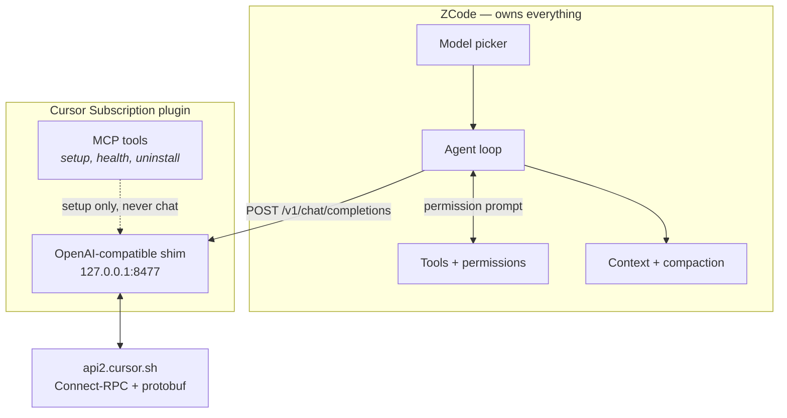
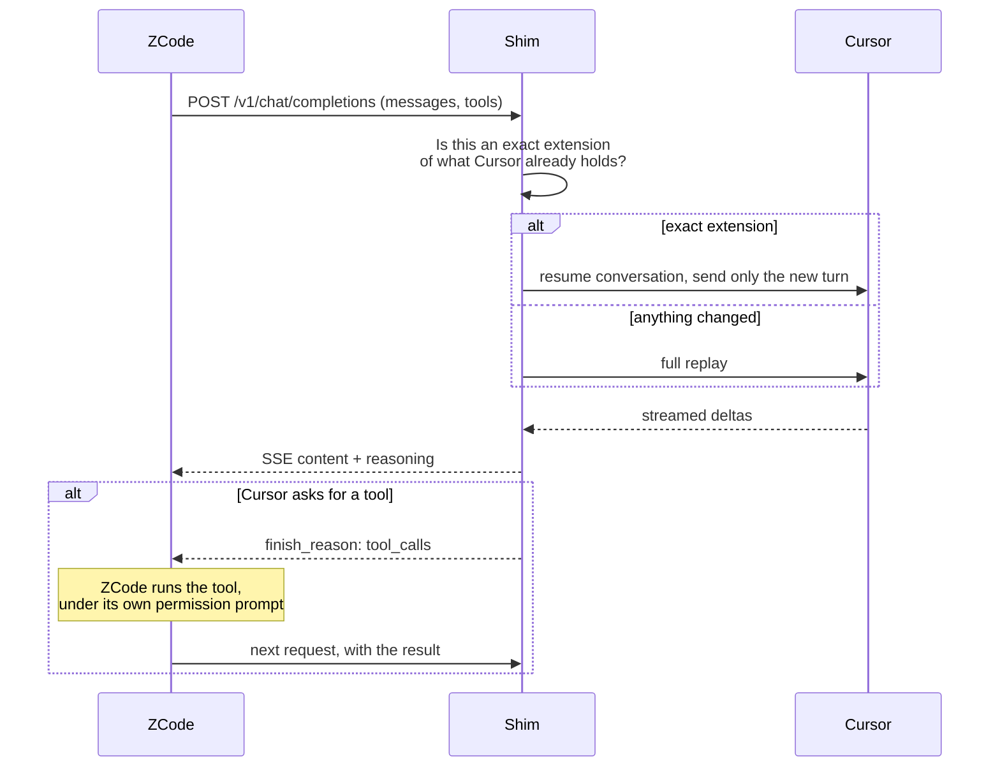

# Cursor Subscription for ZCode

Use your Cursor subscription as a **first-class model provider in [ZCode](https://github.com/zhipuai/zcode)** —
Cursor models appear in the model picker and behave like any other ZCode model: your own tools, your own
permission prompts, ZCode's own context management and compaction.

One command to set it up. Nothing to paste into Settings.

```
/connect-cursor-and-initialize
```

> ⚠️ Cursor's agent protocol is **undocumented and reverse-engineered**. This is a community project and
> may stop working when Cursor changes its servers or client version. Relaying a consumer subscription
> through a third-party client is the activity most likely to trip Cursor's account protections — use it
> for your own local work. Not affiliated with, endorsed by, or supported by Anysphere or Cursor.

---

## Why it is built this way

The obvious way to expose another agent's models is as a *tool*: the agent calls a tool, the tool returns
text. That is also the worst way. Every token would flow through a single tool result — no per-tool
permission prompt, no structured diff, no compaction awareness, and an unbounded context window.

So this is not a tool. It is a provider.



Chat never routes through MCP. The Cursor model is reached over an ordinary OpenAI-compatible HTTP
endpoint, so ZCode's context builder, tool loop and permission system apply to it unchanged.

A Cursor "run" is therefore bounded by one ZCode turn. That is deliberate: **the shim never executes a
tool**, so it cannot bypass a permission prompt.

### One turn, end to end



## Install

**1. Add this repository as a plugin marketplace**

ZCode → Plugin Marketplace → Add → Add Plugin Marketplace, then paste the repository root (the folder
containing `marketplace.json`).

**2. Install *Cursor Subscription*** from that marketplace. Nothing happens yet — no network call is
made on install.

**3. Run one command**

```
/connect-cursor-and-initialize
```

It adopts your Cursor session, proves it can answer, creates the provider, and publishes every model
your account can use. Then quit ZCode (⌘Q) and reopen it so the picker picks the list up.

## What is actually new here

The upstream project this is built on is a working integration for a different host. Turning it into a
ZCode provider was a port, not a copy — and most of the work is the part that is not in the original.

| | |
|---|---|
| **Research** | A cited dossier ([`docs/RESEARCH-FINDINGS.md`](docs/RESEARCH-FINDINGS.md)) reverse-engineering Cursor's protobuf agent protocol, and ZCode's own provider/MCP/streaming contracts, from the source of both |
| **Protocol re-derivation** | Protobuf field numbers, header sets, timing constants and the exec-rejection table verified against a second implementation rather than assumed |
| **Harness-native design** | Choosing a first-class provider over an MCP chat tool, and the resume-vs-replay interlock that makes Cursor's server-side context safe to reuse at all |
| **Onboarding** | A single `cursor_connect_and_initialize` call: adopt, verify, create the provider, publish all models. The model list is written atomically, matched by base URL, and follows the shim if it moves ports |
| **Port robustness** | Recorded port, a bounded fallback scan, health-checked adoption between concurrent ZCode sessions, and takeover when the owning session exits |
| **Diagnostics** | `cursor_doctor` compares session, shim and provider entry and names the disagreement — probing the socket rather than trusting a startup decision |
| **Clean uninstall** | A teardown that removes the credential, the provider, the model rules, the install record, the cache and the data dir, and verifies nothing survived |
| **Review** | An adversarial review pass ([`docs/REVIEW-REPORT.md`](docs/REVIEW-REPORT.md)) that found nine critical defects, ten independently reproduced |
| **Tests** | 63 tests over the protocol codec, the credential store, the resume interlock, port selection, registration, teardown and diagnosis |

Roughly **62% of the shipped code is new**; the derived third is the transport and auth layer listed
per-file in [`NOTICE.md`](cursor-subscription/NOTICE.md).

## Repository layout

```
marketplace.json                     the plugin catalogue — add this folder as a marketplace
docs/
  RESEARCH-FINDINGS.md              cited research dossier: protocol, host contracts, options
  REVIEW-REPORT.md                   adversarial review of the protocol implementation
cursor-subscription/
  .zcode-plugin/plugin.json          plugin manifest
  .mcp.json                          MCP server: setup, health and uninstall tools
  commands/                          the slash commands
  lib/                               shim, protocol client, credential store, provider config
  scripts/                           MCP server and standalone shim entry points
  test/                              63 tests, `node --test`
```

## Development

```sh
cd cursor-subscription
node --test "test/*.test.mjs"
```

No dependencies, no build step. Node 20+ (it uses `node:sqlite` to read Cursor's local session).

## Safety

- Credentials are written `0600` inside a `0700` directory, atomically, with a compare-and-swap so
  concurrent runs cannot clobber each other's token refresh.
- No token ever appears in a tool response, a log line, an error message or a skill.
- The shim binds loopback only and rejects unauthenticated requests in constant time.
- The repository contains no credentials; the ignore rules keep them out.

## Credits

Built on **[dsh-cursor-subscription](https://github.com/orrinzeng/dsh-cursor-subscription)** by
[orrinzeng](https://github.com/orrinzeng) (MIT), which does the same thing for DeepSeek Harness and
which made this port possible. `lib/proto.mjs`, `lib/auth.mjs` and `lib/cursor-client.mjs` are derived
from it; the remaining modules, the research, the host integration and the tooling are new work on top.

Per-file derivations: [`cursor-subscription/NOTICE.md`](cursor-subscription/NOTICE.md).
Licence: [MIT](LICENSE) — see also the notice carried inside the installed plugin.

## Licence

MIT. See [LICENSE](LICENSE).
