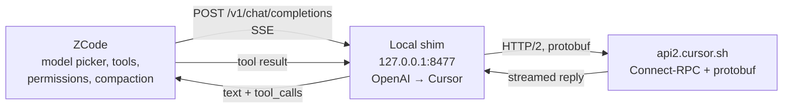

# Cursor Subscription for ZCode

Use a Cursor subscription as a **first-class ZCode model provider**. Cursor models appear in the model
picker and behave like any other ZCode model: your own tools, your own permission prompts, ZCode's own
context management and compaction.



The shim never executes a tool. When Cursor asks for one, the shim ends the run with
`finish_reason: "tool_calls"`, so **ZCode** runs the tool under **ZCode's** permission system.

## Setup — one command

```
/connect-cursor-and-initialize
```

That single call does the whole thing:

1. adopts the Cursor session already on this machine — no browser, no second sign-in
2. proves it can answer, with a real completion on a few cheap models
3. creates the provider entry in ZCode's config
4. publishes every model your account can use

There is nothing to paste into Settings. Quit ZCode (⌘Q) and reopen it, then pick a model.

If you have **no local Cursor install**, the browser PKCE flow (`cursor_login`) is used instead. The
agent only falls back to it when no local session is found.

## How it works

ZCode speaks `openai-chat-completions` to providers. Cursor's agent protocol is protobuf over
bidirectional HTTP/2. A small local shim translates between the two and binds loopback only.

### Tool calling — one contract, every repository

Cursor's models natively call their **own** tool set — 41 exec variants in Cursor's bundle, the
same Unix primitives agents have wrapped for 30 years (read, write, search, list, run, fetch,
diff, fork) under Cursor's names. The shim translates each onto ZCode's native tools **with the
host's parameter names**, so nothing depends on the repository underneath. One row per native
tool; `→` marks a translation, anything else is the typed reply that keeps the run alive.

| Cursor native tool | Field | What it does | Handling |
|---|---|---|---|
| `shell_args` | 2 | [Run a shell command] One command, captured output | → `Bash` (+ cwd prefix, `timeout`, `description`, `run_in_background`) |
| `write_args` | 3 | [Write a file] Full-file write (`path`, `file_text`) | → `Write` (`file_path`, `content`) |
| `delete_args` | 4 | [Delete a file] | Refused — no safe host delete |
| `grep_args` | 5 | [Search file contents] Regex, output mode, context, type | → `Grep` (all flags incl. `-i`, `-B`/`-A`, `type`) |
| `read_args` | 7 | [Read a file] Contents with offset/limit | → `Read` (`path`→`file_path`) |
| `ls_args` | 8 | [List a directory] | → `Glob` (`pattern: "*"` synthesized) |
| `diagnostics_args` | 9 | [Get code diagnostics] LSP errors/warnings | Refused — LSP is the host's |
| `request_context_args` | 10 | [Ask what tools exist] The declaration handshake | Served: host tool schemas |
| `mcp_args` | 11 | [Call a registered tool] The declared-tool channel | Passed through verbatim |
| `shell_stream_args` | 14 | [Stream a shell command] Live stdout/stderr events | → `Bash` |
| `background_shell_spawn_args` | 16 | [Spawn a background shell] Long-running process | → `Bash` (`run_in_background` forced) |
| `list_mcp_resources_exec_args` | 17 | [List MCP resources] | Refused (typed error arm) |
| `read_mcp_resource_exec_args` | 18 | [Read an MCP resource] | Refused (typed error arm) |
| `fetch_args` | 20 | [Fetch a URL] | → `WebFetch` (`prompt` synthesized) |
| `record_screen_args` | 21 | [Record the screen] | Refused — no screen access |
| `computer_use_args` | 22 | [Drive the computer] Mouse/keyboard control | Refused |
| `write_shell_stdin_args` | 23 | [Feed a shell's stdin] | Refused |
| `execute_hook_args` | 27 | [Run a lifecycle hook] | Refused (typed) |
| `subagent_args` | 28 | [Dispatch a subagent] Nested agent, own type/model/prompt | → `Agent` (`description` synthesized) |
| `redacted_read_args` | 29 | [Read a file, redacted] | → `Read` |
| `force_background_shell_args` | 30 | [Background a shell] | Refused (typed) |
| `force_background_subagent_args` | 31 | [Background a subagent] | Refused (typed) |
| `mcp_state_exec_args` | 36 | [Poll MCP server state] | Refused (typed) |
| `subagent_await_args` | 37 | [Await a subagent] Poll a background agent | → `TaskOutput` (`agent_id`→`task_id`) |
| `smart_mode_classifier_args` | 38 | [Classify the request] Internal routing | Refused (typed) |
| `canvas_diagnostics_args` | 40 | [Canvas diagnostics] | Refused (typed) |
| `shell_allowlist_precheck_args` | 41 | [Precheck a command] "Pre-approved?" | Answered `allowlisted=false` |
| `mcp_allowlist_precheck_args` | 42 | [Precheck an MCP call] | Answered `allowlisted=false` |
| `web_fetch_allowlist_precheck_args` | 43 | [Precheck a fetch] | Answered `allowlisted=false` |
| `git_diff_request` | 44 | [Show a git diff] Structured refs/paths/context | → `Bash` (quoted `git diff`) |
| `pi_read_args` | 45 | [Read a file] Pi family | → `Read` |
| `pi_bash_args` | 46 | [Run a command] Pi family, with timeout | → `Bash` |
| `pi_edit_args` | 47 | [Edit by replacement] `{old_text→new_text}` list | → `Edit` (single edit; multi-edit refused) |
| `pi_write_args` | 48 | [Write a file] Pi family | → `Write` |
| `pi_grep_args` | 49 | [Search file contents] Pi family | → `Grep` |
| `pi_find_args` | 50 | [Find files by name] Pi family | → `Glob` |
| `pi_ls_args` | 51 | [List a directory] Pi family | → `Glob` |
| `mini_swe_agent_bash_args` | 52 | [Mini-agent bash] | Refused (typed) |
| `conversation_search_args` | 53 | [Search past chats] | Refused (typed) |
| `agent_store_conflict_args` | 54 | [Resolve a store conflict] | Refused (typed) |
| `adopt_args` | 56 | [Adopt a session] | Refused (typed) |

Variants Cursor ships later get the last handling automatically: a generic typed reply on the
message's own field, so a run never hangs on an unknown tool.

**The other side — ZCode's native tools we translate onto** (every one is also registered with
Cursor as a first-class tool via `mcp_args`, so models can call them directly):

| ZCode tool | What it does | Schema facts that matter |
|---|---|---|
| `Read` | [Read a file] 1-based line offset/count, 2,000-line default | `file_path` **required** |
| `Write` | [Write a file] Create or overwrite | `file_path` + `content` **required** |
| `Edit` | [Replace text in a file] Exact match, optional replace-all | `file_path`, `old_string`, `new_string` **required** |
| `Bash` | [Run a shell command] Timeout, background, sandbox | `command` **required**; **strict** schema |
| `Grep` | [Search file contents] Ripgrep, output modes, flags | `pattern` **required**; `output_mode` enum |
| `Glob` | [List files by pattern] The only listing tool | `pattern` **required** |
| `WebFetch` | [Fetch a URL and answer about it] Cached 15 min | `url` + `prompt` **required** |
| `Agent` | [Dispatch a subagent] Own context and tool profile | `description` + `prompt` **required** |

Plus the rest of the host toolbox through the declared-tool channel: `WebSearch`, `TodoRead`/
`TodoWrite`, `TaskOutput`/`TaskStop`, `Skill`, `AskUserQuestion`, `EnterPlanMode`/`ExitPlanMode`,
the `Cron*` family, agent messaging, `ListModels`, `js`, and the workflow tools.

Two guarantees hold on the translation path: arguments always match the host's declared schema
(a wrong parameter name is not an error you can see — it is a call that fails validation on
every retry), and a call that cannot satisfy the host's required fields is refused with a
legible typed reply instead of emitted and doomed.

The argument-level detail — every rename, every synthesized field, every typed reply shape — is
in [`docs/TRANSLATION-MAP.md`](../docs/TRANSLATION-MAP.md). The machine-readable contract is
served live by the running shim at `GET /internal/translation` (derived from the implementation:
supported, passthrough and refused cases, plus that process's translated/refused/repeated/dropped
counts), and `/internal/status` carries the same counters with resume telemetry — so you can
always see which path a turn actually took, and a model that regenerates the identical call is
broken out of the loop with a legible advisory instead of burning quota.

### Context and cost

ZCode owns the conversation and rewrites it between turns — auto-compaction, microcompaction, edits and
branches all change history. So the shim does not blindly resume a server-side Cursor conversation;
that would leave Cursor reasoning about messages you can no longer see, with no error anywhere.

Instead it records what it committed to Cursor and checks, every turn, whether your messages are an
**exact extension** of that:

| | Cost |
|---|---|
| Exact extension | Resume the server-side conversation, send only the new turn |
| Anything changed | Full replay |

Because the check is against the whole prefix, every operation that rewrites history automatically
forces a replay. The worst case is exactly what a replay-only design would cost, and never worse.

`cursor_status` reports the **resume rate** — the share of turns that reused Cursor's context. That is
the number worth watching. Cursor does not expose cache-hit telemetry to third-party clients, so a
"cache hit rate" is not something this plugin can honestly claim.

### Ports

The shim prefers port `8477` and **records the port it bound**. If something else already holds it and
is not one of ours, it moves to the next free port rather than failing. Two ZCode sessions is a normal
case: the second adopts the port the first is serving instead of starting a duplicate, and takes it
over if the first exits. `cursor_doctor` probes the socket rather than trusting that decision, so a
dead port is reported as dead.

## Commands

| Command | Purpose |
|---|---|
| `/connect-cursor-and-initialize` | **Start here.** Connects, verifies, creates the provider and registers every model |
| `/cursor-status` | Sign-in state, token expiry, shim health and resume rate |
| `/cursor-models` | List the models your account can use, without changing anything |
| `/uninstall-cursor-and-plugin` | Remove the plugin completely so a reinstall starts clean |

## Tools

| Tool | Purpose |
|---|---|
| `cursor_connect_and_initialize` | The whole onboarding in one call |
| `cursor_doctor` | Read-only: session, shim and provider entry — and whether they agree |
| `cursor_import` | Adopt the session from a local Cursor install — no browser needed |
| `cursor_login` | Browser PKCE sign-in, for machines without Cursor installed |
| `cursor_selftest` | A real tiny completion on several auto-picked cheap models |
| `cursor_register_models` | Write the discovered models into ZCode's provider config |
| `cursor_status` | Sign-in state, token expiry, shim health and resume rate |
| `cursor_models` | List the models your account can use |
| `cursor_logout` | Delete the stored credential, keeping the plugin installed |
| `cursor_uninstall` | Remove the plugin, its config, and the cached model list |

## Safety

- Credentials are written `0600` in a `0700` directory, atomically, with a compare-and-swap so two
  concurrent runs cannot clobber each other's token refresh.
- No token ever appears in a tool response, a log line, an error message or the skill.
- The shim binds loopback only and rejects unauthenticated requests in constant time.
- **Nothing happens on install.** No network call is made until you sign in.

## ⚠️ Please read

Cursor's agent protocol is **undocumented and reverse-engineered**. It can stop working without notice
when Cursor changes its servers or client version.

Relaying a consumer subscription through a third-party client is exactly the activity most likely to
trip Cursor's account protections. Use it for your own local work, and do not redistribute it or use it
to serve other people. You are shown this notice before signing in.

Not affiliated with or endorsed by Anysphere.

## Troubleshooting

| Symptom | Cause |
|---|---|
| Provider 401 | The API key in ZCode does not match the one the plugin wrote |
| Connection refused | Shim not running, or the provider's Base URL and the shim's port disagree — `cursor_doctor` names it |
| `cursor_doctor` says the ports disagree | The shim moved ports; re-run `cursor_connect_and_initialize` to bring the entry back in step |
| Cursor turn fails with `CURSOR_ERROR` | Cursor changed the protocol or client version |
| Tool calls do nothing | Cursor asked for one of its own built-in tools; the shim refuses those by design |
| Sign-in times out | The browser flow was not completed; polling waits about 2.5 minutes |
| `cursor_import` fails | Cursor is installed but not signed in — open Cursor and sign in there first |

**Do not retry a failed run automatically.** Cursor's streaming protocol cannot prove a failed attempt
was not processed remotely, so a retry can duplicate work and burn your quota.

## Credits

Built on **[dsh-cursor-subscription](https://github.com/orrinzeng/dsh-cursor-subscription)** by
orrinzeng (MIT), which does the same thing for DeepSeek Harness. `proto.mjs`, `auth.mjs` and
`cursor-client.mjs` are derived from it; everything else here is new. See
[`NOTICE.md`](./NOTICE.md) for the per-file derivation, and [`LICENSE`](./LICENSE).

## Request controls

ZCode can send request parameters Cursor's run request has no field for. Rather
than dropping them, each is either honoured by construction or reported:

| Host sends | What happens |
|---|---|
| `tool_choice: "none"` | No tools are registered — a host told "none" that still receives a tool call has been lied to |
| `tool_choice: {function: {name}}` | Only that tool is registered; the rest would let the model pick what the host ruled out |
| `tool_choice: "required"` | Not expressible; reported, because the model may still answer in prose |
| `parallel_tool_calls: false` | Honoured — the run already ends at the first tool call |
| `response_format: json_object` / `json_schema` | Folded into the system prompt as an instruction, aiming the model at the schema |
| `temperature`, `top_p`, `stop`, `seed`, penalties | Named as inexpressible rather than silently ignored |

`cursor_doctor` lists any approximation a session has used, so the difference
between "the shim is broken" and "the shim is approximating, and here is exactly
where" is visible in one call.

## Development

```sh
node --test test/*.test.mjs          # 118 unit tests, no quota
CURSOR_LIVE_TESTS=1 node test/live-structured.mjs [baseUrl]   # the replay matrix
CURSOR_LIVE_TESTS=1 node test/live-roundtrip.mjs [models]
CURSOR_LIVE_TESTS=1 node test/live-conversation.mjs [model]
node test/sad-paths.mjs              # malformed input; one real completion
```

The live probes spend real quota and refuse to run unless `CURSOR_LIVE_TESTS=1`. They exist because
the biggest defect in this project was invisible to unit tests: every layer encoded correctly and
tool calling still did nothing. See [`docs/HARNESS-AUDIT.md`](../docs/HARNESS-AUDIT.md).

`CURSOR_SHIM_DEBUG=1` prints every frame kind, every exec case and the raw bytes of each exec. It is
what turns "the tool call does not fire" into a specific unknown field number in one run.

The research dossier — protocol field maps, host contracts, the alternatives considered and why they
were rejected — is in [`docs/RESEARCH-FINDINGS.md`](../docs/RESEARCH-FINDINGS.md). The adversarial
review that shaped the protocol code is in
[`docs/REVIEW-REPORT.md`](../docs/REVIEW-REPORT.md).
