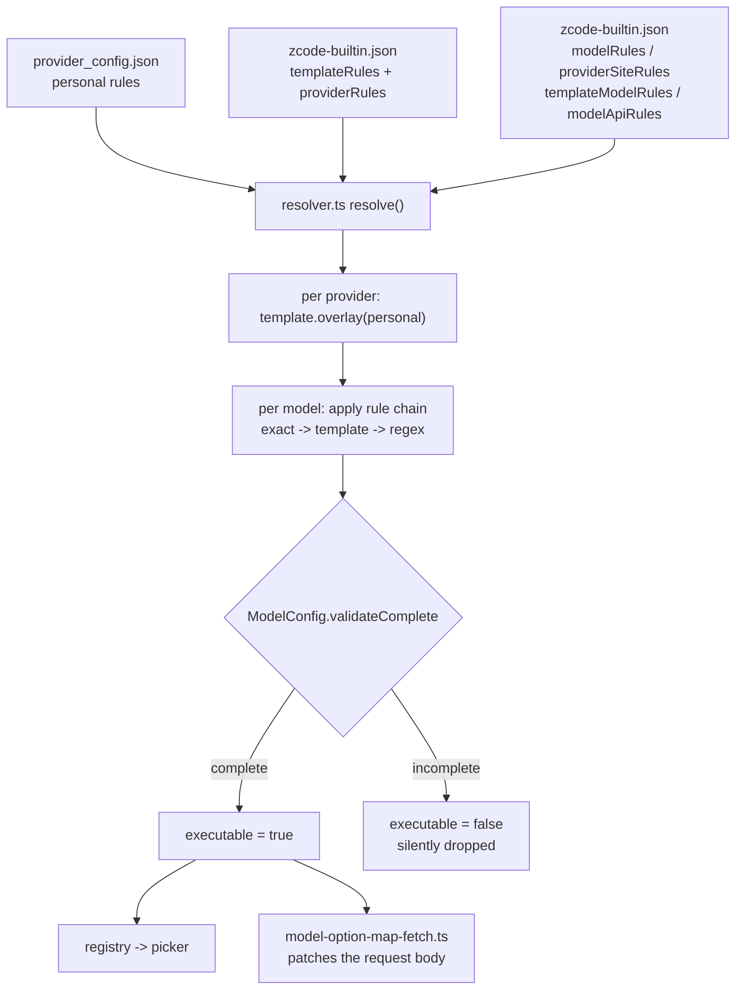

# How ZCode natively maps a provider

Reverse-engineered from the ZCode 3.14.3 source. This is the reference for making
the Cursor shim a first-class citizen rather than something that merely works.

Source of truth: `packages/provider/src/config/provider-data-schema.ts`,
`packages/provider/src/resolver.ts`, `packages/provider/src/config/model-config.ts`,
`packages/shared/src/model-config.ts`, `config/provider/zcode-builtin.json`.

---

## 1. The resolution pipeline



Two layers always combine: a **built-in catalog** (`config/provider/zcode-builtin.json`)
and the **personal layer** (`~/.zcode/v2/provider_config.json`). Nothing in the
personal layer has to be complete on its own — the built-in rules fill the gaps.

## 2. Provider shape

`providerApiTypeDataSchema` is a closed enum of exactly three:

```
anthropic-messages | openai-chat-completions | openai-responses
```

`providerConfigDataSchema` is **`.strict()`** — an unknown key is a validation
failure, not a warning. All fields are optional in the sparse form:

```ts
{ group, logo, access, api, builtinModelIds, personalModelIds, modelOrder, visibility }
```

A provider is only *executable* when its **complete** form validates:
`group` non-null, `access` complete (for `api-key`: a non-blank `apiKey`), and
`api` complete (`type` + a URL `baseUrl`).

`group` is one of `standard-personal | zai-family | bigmodel-family`. A
user-created provider is always `standard-personal`, and built-ins may not use
that group — which is what keeps the two layers from colliding.

**There is no `providerOrder` inside a provider.** Ordering lives on the personal
layer, not in the rule.

## 3. Built-ins are data, templates are not providers

- `providerRules` in `zcode-builtin.json` are real providers — `account:zai-start-plan`
  and friends.
- `templateRules` are **templates**, never providers. `opencode-go-messages` is a
  template, not a provider:

```json
{ "templateId": "opencode-go-messages",
  "templateNameMap": { "en-US": "OpenCode Go (Anthropic)" },
  "config": {
    "access": { "type": "api-key", "apiKeyManagementUrl": "https://opencode.ai/auth" },
    "api": { "type": "anthropic-messages", "baseUrl": "https://opencode.ai/zen/go/v1" },
    "builtinModelIds": ["minimax-m3", "qwen3.8-max", ...],
    "logo": { "type": "builtin", "key": "opencode" } } }
```

A personal rule may name a `templateId`, and the template config is overlaid
*under* the personal config (`template.overlay(personal)`). So a custom provider
is either template-backed or self-describing — it does not need both.

The default for a user-created provider is `api.type: "openai-chat-completions"`,
which is what the shim serves, so no template is required.

## 4. How a model gets its configuration

Ids come from the union of `builtinModelIds` and `personalModelIds` (dedup, then
`modelOrder` applied). Each id then has a **rule chain** applied in order, each
step overlaying the previous:

1. exact rule — `providerModelRules` / `manualProviderModelRules` (providerId + modelId)
2. template rule — `templateModelRules` (templateId + modelId)
3. regex rule — `modelRules` (`modelMatch`, optionally `apiTypeMatch`, `baseUrlMatch`)
4. site rule — `providerSiteRules` (keyed on `baseUrlMatch`)
5. api rule — `modelApiRules` (`apiTypeMatch`)

**The catch-all matters enormously.** `zcode-builtin.json` ends with:

```json
{ "modelMatch": ".*", "config": {
    "enabled": true,
    "properties": { "contextWindow": 200000,
      "inputFormat": { "supportsText": true, "supportsImage": false, ... },
      "supportsToolCall": true, ... },
    "optionSpecs": {
      "maxOutputTokens": { "max": 32000 },
      "reasoningLevel": { "values": ["disabled", "enabled"], "map": "{}" } } } }
```

So **a model id with no specific rule is not dropped** — it is enabled with
generic metadata. That is why a personal provider listing bare ids behaves
sanely at all.

But `enabled` alone is not enough to be shown. From `resolver.ts`:

```ts
const modelEnabled = modelConfig.enabled === true;
const executable = providerExecutable && modelEnabled && modelIssues.length === 0;
const selectable = executable && config.visibility !== "hidden";
```

A model whose resolved config does not validate as **complete** gets
`executable: false` and is **silently excluded** — visible only as `issues` in
Settings. The failure mode is a model that simply is not there.

## 5. `optionSpecs` — and the one thing worth copying

`ModelOptionName` is exactly two values, and the schema is `.strict()`:

```
reasoningLevel  { values: string[], map?: string }
maxOutputTokens { max: number,     map?: string }
```

`map` is a restricted CEL-like expression compiled and validated at schema-parse
time. It has **one** variable — the option's own value. It must evaluate to a
JSON object, which is then merge-patched into the outgoing request body by
`model-option-map-fetch.ts`, which intercepts `fetch` and rewrites the
JSON body before it leaves.

That file calls the map "the sole request-field authority" for those two
options. So this is the **natively supported** way to translate a
`reasoningLevel` selection into provider-specific request fields — no shim logic
required.

The live example from the user's config, for `anthropic-messages`:

```
reasoningLevel == "disabled"
  ? { "thinking": { "type": "disabled" } }
  : { "thinking": { "type": "adaptive" },
      "output_config": { "effort": reasoningLevel == "enabled" ? "max" : reasoningLevel } }
```

`maxOutputTokens` is `optionSpecs.maxOutputTokens.max` — it is not a model
property, and there is no separate `maxTokens` field.

## 6. No discovery, ever

Greps for `v1/models`, `fetchModels`, `discoverModels`, `listModels` across the
UI, services and provider packages return nothing. **ZCode cannot discover models
from a custom provider.** "Add model" is a manual `addPersonalModel` that appends
to `personalModelIds`, sets `modelOrder`, and writes an exact rule.

This is the entire reason this plugin has a `cursor_register_models` tool. The
gap is real and there is no endpoint to call.

## 7. What a first-class custom provider needs

Minimum, and all of it is what `ensureShimProvider` already writes:

| Needed | Why |
|---|---|
| `providerId` | identity; `account:` prefix is reserved for built-ins |
| `group: "standard-personal"` | personal providers may not claim a built-in group |
| `access: { type: "api-key", apiKey }` | complete access is required for `executable` |
| `api: { type: "openai-chat-completions", baseUrl }` | the shim's native shape |
| `personalModelIds: [...]` non-empty | a provider with zero executable models is dropped |
| at least one model that validates complete | otherwise the whole provider disappears |

What degrades **silently** if omitted:

- No `reasoningLevel` map → `"{}"`, so no request fields are patched and the
  server's defaults apply. A user selecting a reasoning level sees no effect.
- No metadata override → 200k context, no image support, generic flags.
- An incomplete model config → the model is excluded with no error at the
  call site.
- `visibility: "hidden"` → present but unselectable.

## 8. What this means for the Cursor shim

Three concrete follow-ups, in order of value:

1. **`providerSiteRules` keyed on the shim's base URL.** This is the native
   mechanism for per-provider model metadata, and it is what a real provider
   integration would use. It lets us declare honest properties — Cursor models
   accept images, so `supportsImage: true`, and a real context window — and a
   `reasoningLevel` map, instead of relying on the generic catch-all. Without
   it, every Cursor model is advertised as text-only with a 200k window.

2. **A `reasoningLevel` map, once the wire format is known.** If Cursor's run
   request has a field for thinking effort, the map is where it belongs —
   natively, not in shim code. `thinking` models exist on the account
   (`claude-4.5-sonnet-thinking` and similar), so the selection is meaningful
   and currently ignored.

3. **Verify completeness.** A model that fails to validate is dropped with no
   error. `cursor_doctor` should check that each registered model resolves to a
   complete config, so a silently-excluded model is reported rather than
   discovered as "that model isn't in the picker".

---

## Sources

| Claim | Source |
|---|---|
| `api.type` closed enum | `packages/provider/src/config/provider-data-schema.ts:4-8` |
| provider config is `.strict()` | same, `:83-94` |
| complete form requirements | same, `:95-99`, `:30-70` |
| group rules for built-in vs personal | `packages/provider/src/config/rule-data-schema.ts:103-123` |
| id union + `modelOrder` | `packages/provider/src/resolver.ts:237-248` |
| rule chain | `packages/provider/src/config/model-config.ts:387-423` |
| catch-all `modelMatch: ".*"` | `config/provider/zcode-builtin.json` |
| `executable` gate | `packages/provider/src/resolver.ts:278-280`, `:312`, `:324` |
| `opencode-go-messages` is a template | `zcode-builtin.json` `templateRules` |
| template overlay | `packages/provider/src/resolver.ts:201-207` |
| optionSpecs schema | `packages/shared/src/model-config.ts:88-100` |
| map evaluation + fetch patch | `apps/zcode-cli/packages/adapters/src/model/model-option-map-fetch.ts:17-25,52-54` |
| no discovery | greps across `packages/ui`, `packages/services`, `packages/provider` |
